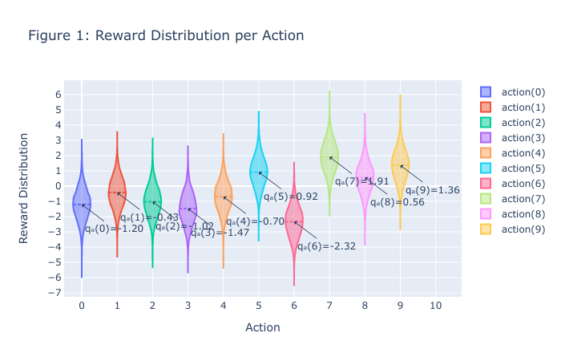
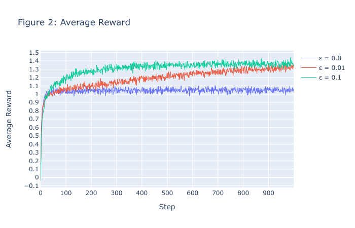
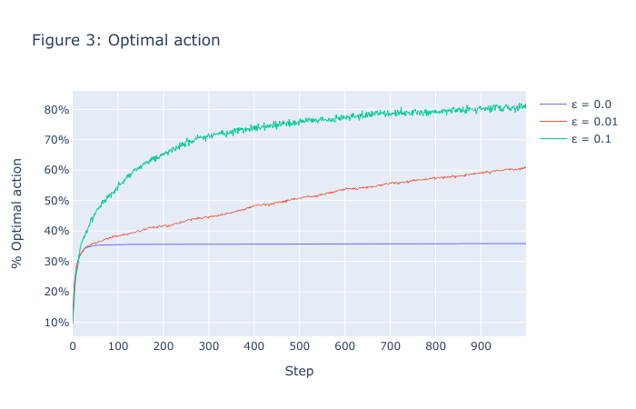

# 10-Armed Bandid Problem

Implementation of the 10-armed bandit problem from "Reinforcement Learning: An Introduction" second edition p.21 by Sutton and Barto.   

## Features
- Very flexible. One can change the following parameters:
  - for number of arms for the bandits
  - number of runs
  - number of timesteps
  - epsilon.
  - reward distribution,
  - reward noise distribution

- The usage of Numba jit-compiler makes the testbed very fast. An experiment with a 10 armed bandit, for 3 different epsilons with with 2000 runs for 1000 steps each takes only 1.32 sec compared to 77.6 seconds without Numba

## Description
To roughly assess the relative effectiveness of the greedy and ε-greedy methods, we compare them numerically on a suite of test problems. This was a set of 2000 randomly generated k-armed bandit problems with k = 10.

For each bandit problem the action values, $q_∗(a)$&emsp;$a = 1, . . . , 10$, were selected according to a normal (Gaussian) distribution with mean 0 and variance 1.  
Then, when a learning method applied to that problem selected action $A_t$ at time step t, the actual reward, $R_t$, was selected from a normal distribution with mean $q_∗(A_t)$ and variance 1.  
These distributions are shown in Figure 1.

  
For any learning method, we can measure its performance and behavior as it improves with experience over
1000 time steps when applied to one of the bandit problems. This makes up one run. Repeating this for 2000 independent runs, each with a different bandit problem, we obtained measures of the learning algorithm’s average behavior.  
Figure 2 and 3 compares a greedy (ε = 0) method with two ε-greedy methods (ε = 0.01 ε = 0.1), as described above, on the 10-armed testbed. All the methods formed their action-value estimates using the sampleaverage technique.

  
Figure 2 shows the increase in expected reward with experience.  
The greedy method improved slightly faster than the other methods at the very beginning, but then leveled off at a lower level. It achieved a reward-per-step of only about 1, compared with the best possible of about 1.55 on this testbed. The greedy method performed significantly worse in the long run because it often
got stuck performing suboptimal actions.

  
Figure 3 shows that the greedy method found the optimal action in only approximately one-third of the tasks. In the other two-thirds, its initial samples of the optimal action were disappointing, and it never returned to it. The ε-greedy methods eventually performed better because they continued to explore and to improve their chances of recognizing the optimal action. The ε = 0.1 method explored more, and usually found the optimal action earlier, but it never selected that action more than 91% of the time. The ε = 0.01 method improved more slowly, but eventually would perform better than the ε = 0.1 method on both performance measures shown in the figure. It is also possible to reduce ε over time to try to get the best of both high and low values.
